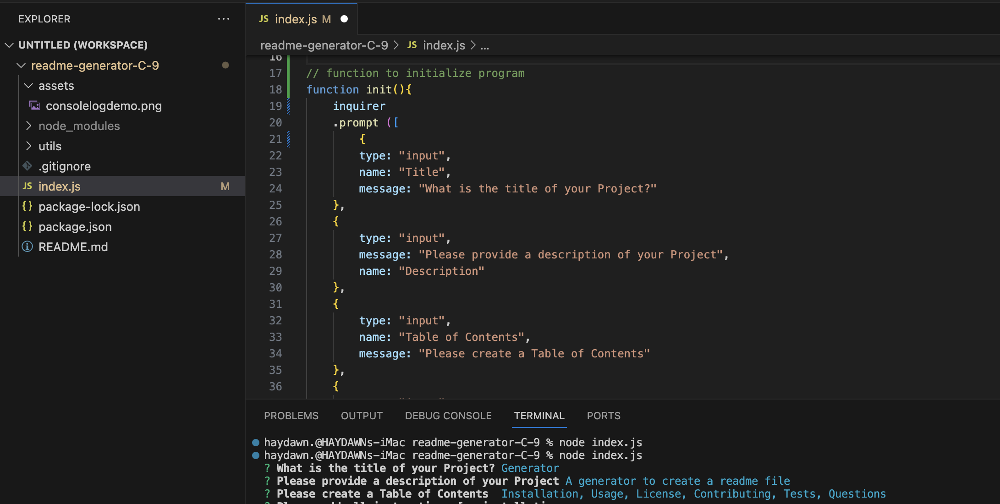

# readme-generator-C-9

## Description 
A command-line application that dynamically generates a professional README.md file from a user's input.
  
  
## Video Demo

The following video demonstrates the application functionality:

## Screenshots

  

## References
[NPMIS](https://www.npmjs.com/package/inquirer)

## License

This project is licensed under the MIT License
©2023. Haydawn Wilson. All Rights Reserved.